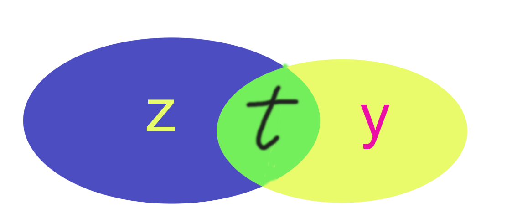
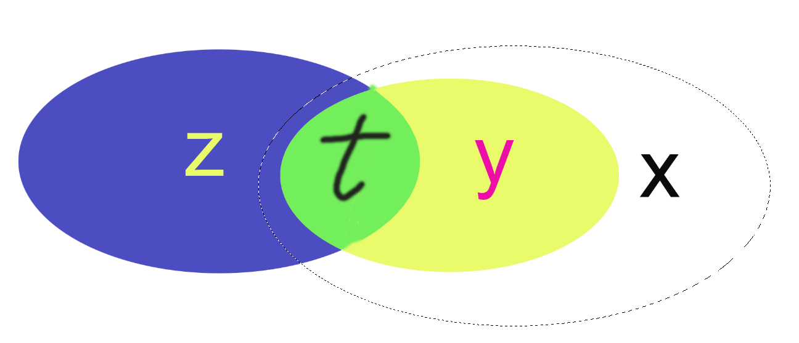

# logtrick的用法与实战

**logtrick是我从灵神视频中学习到的,此文章介绍logtrick用法与实践,以及灵神视频中未提到的,我本人总结出来的小技巧**

## 用法

**logtrick通常用于求 子数组(gcd,lcm,&,|)后的max或者min或者计数问题**

### 子数组问题

**logtrick主要是解决子数组问题,所以在此我们先引出子数组问题**

#### 什么是子数组问题?

**就是求 f(l,r)的所有操作的(最优值 或者 计数值) 1<=l<=r<=n;**

**类似这个公式:**
$$
\sum_{l=1}^{n} \sum_{r=l}^{n} f(l, r)
$$
**但不一定是求和,应是题目要求的求(最优值 或者 计数值)等**

**这个f即函数 是求区间[l,r]完成题目特定操作后 得到的特定值 **

**比如说:f(l,r),f函数是求min的 那么就是求[l,r]区间中最小的一个值**

### **如何高效计算**子数组问题

计算子数组，有一种可行思路是把注意力放在**右端点**，通过不断移动右端点，在移动的时候利用前面的统计结果算出移动右端点后的结果，从而得出所有子区间的答案。

这种方法经典套路有 **前缀和,logtrick**

今天我们重点是**logtrick**

**logtrick是基于O(n^2)的计算子数组问题 利用(|,&,lcm,gcd)等性质 优化的一种套路亦或者是算法**

**先介绍o(n^2)的算法**

```c++
for(int i = 0; i < n;i++){
	for(int j = i - 1;j >= 0;j--){
		a[j] ?= a[i]; //此问号可以为gcd lcm | &
	}
}
```

**这个算法挺清晰的我们研究一下过程,然后考虑优化**

**比如说 求a的子数组按位&等于k的子数组的总和**

**给出数据与对应二进制:**

```c++
 7   	 			 3  	 			  4  	 			  1
111 				011  	 			 100  	 			 100     
```

**操作流程:**

```
第一次:
             7   	 			 3  	 			  4  	 			  1
            111 				011  	 			 100  	 			 901

存储:		  a[0]
			111			

第二次:
             7   	 			 3  	 			  4  	 			  1
            111 				011  	 			 100  	 			 001

存储:		 a[0]&a[1]	          a[1]
			011                 011

第三次:
             7   	 			 3  	 			  4  	 			  1
            111 				011  	 			 100  	 			 001

存储:	 a[0]&a[1]&a[2]	        a[1]&a[2]               a[2]
			000                 000					 100
			
第四次:
             7   	 			 3  	 			  4  	 			  1
            111 				011  	 			 100  	 			 001

存储:	 a[0]&a[1]&a[2]&a[3]  a[1]&a[2]&a[3]         a[2]&a[3]             a[3]
			000                 000					 000				 001
```

**可以发现这样枚举右端点更新左端点可以保证求出所有的子数组的运算结果**

**优化:**

这是最最最重点的了我们发现第三次到第四次过程中是没有变化的,为什么呢,因为&越多数&的的总结局是越来越小

而&不变就是说明了我这个数已经不足以让当前位置变小,又因为当前位置的前面都是与当前位置&过的,所以不能让当前位置变小也自然不会让前面位置再变小,**这点很难理解**用灵神的话来讲就是看做是集和的关系,我后面枚举的这个数设为x & 当前这个数设为y然后 y不变小, 意味这 y 一定是x的子集 而y前面的数都&过y 说明都是与y的交集了,与x交就相当于没有交; **很难理解借助图形理解**

**图形**

我们设当前枚举的是x  然后 x&y=y , 然后y前面的数为z  z&y设为 t

前面的数组的记录的数t是这样的



y是x的子集所以加入x长这样



虚线部分是x,可以看到加入x是不会对y和y前面的t产生影响的 因为 x与y与z的交集还是t

所以当我们遇到 a[j] & a[i] == a[j] 时 直接break ,不必管前面的数

就因为这个小优化我们的时间复杂度可以从

 **O(n^2) 变为 O(nlogU)**

**u为数组中最大值**

**因为我们一个数不断缩小就加强了成为x的子集的可能性,就更可能的触及 a[j] & a[i] == a[j] 这个条件,而最坏也是log级别的缩小,此为logtrick精髓所在**

**除了& 还有| gcd lcm 殊途同归读者自己思考**

## 模版

```c++
for(int i = 1; i <= n;i++){
    int x = nums[i];
    //这里可以进行一些操作
    for(int j = i - 1;j >= 1;j--){
        if((nums[j] 操作 nums[i]) = ?){
            break;
        }
        nums[j] 操作= nums[i];
    }
    然后进行二分或者一些操作
}
```

## 小技巧

**logtrick 配合 map使用有出其不意的效果,甚至说更加无脑与方便,下面题目有讲**

## 实战

### 简单题

**源于灵神总结的题单**

#### **力扣3097**

[3097. 或值至少为 K 的最短子数组 II - 力扣（LeetCode）](https://leetcode.cn/problems/shortest-subarray-with-or-at-least-k-ii/description/)

**思路:**因为如果 nums[j] | nums[i] == nums[i] 就代表前面都不会再变大,所以直接结束,很经典的板子题

```c++
class Solution {
public:
    int minimumSubarrayLength(vector<int>& nums, int k) {
        int mi = 0x3f3f3f3f;
        int n = nums.size();
        for(int i = 0; i < n;i++){
            if(nums[i] >= k){
                return 1;
            }
            for(int j= i - 1; j >= 0 && (nums[j] | nums[i]) != nums[j];j--){
                nums[j] |= nums[i];
                if(nums[j]>=k){
                    mi = min(mi,i-j+1);
                }
            }
        }
        return mi==0x3f3f3f3f ? -1 : mi;
    }
};
```

#### **力扣2411**

[2411. 按位或最大的最小子数组长度 - 力扣（LeetCode）](https://leetcode.cn/problems/smallest-subarrays-with-maximum-bitwise-or/description/)

**思路:和上题类似**

```C++
class Solution {
public:
    vector<int> smallestSubarrays(vector<int>& nums) {
        int n = nums.size();
        vector<int> ans(n,1);
        for(int i = 0; i < n;i++){
            int x= nums[i];
            for(int j = i - 1 ;j >= 0 && (nums[j] | nums[i]) != nums[j];j--) {
                nums[j]|=nums[i],ans[j] = i - j + 1;
            }
        }
        return ans;

    }
};
```

#### 力扣3209

[3209. 子数组按位与值为 K 的数目 - 力扣（LeetCode）](https://leetcode.cn/problems/number-of-subarrays-with-and-value-of-k/description/)

**思路:**该题更快做法应该是二分,但是这里我们用无脑的map计数直接无视二分,让问题难度直线下降

```c++
class Solution {
public:
    long long countSubarrays(vector<int>& nums, int k) {
        long long ans = 0;
        int n = nums.size();
        map<int,int> h;
        for(int i = 0;i<n;i++){
            int x = nums[i];
            h[x]++;
            for(int j = i - 1; j >= 0 && (nums[j] & nums[i]) != nums[j];j--){
                h[nums[j]]--;
                nums[j]&=nums[i];
                h[nums[j]]++;
            }
            ans+=h[k];

        }
        return ans;
    }
};
```

#### **力扣1521**

[1521. 找到最接近目标值的函数值 - 力扣（LeetCode）](https://leetcode.cn/problems/find-a-value-of-a-mysterious-function-closest-to-target/)

**思路:**简单板子运用

```c++
class Solution {
public:
    int closestToTarget(vector<int>& nums, int target) {
        int ans = 0x3f3f3f3f;
        for(int i = 0;i < nums.size();i++){
            ans = min(ans,abs(nums[i] - target));
            for(int j = i - 1;j >= 0;j--){
                if((nums[j]&nums[i]) == nums[j]) break;
                nums[j]&=nums[i];
                ans = min(ans,abs(nums[j] - target));
            }
        }
        return ans;
    }
};
```

#### 力扣898

[898. 子数组按位或操作 - 力扣（LeetCode）](https://leetcode.cn/problems/bitwise-ors-of-subarrays/)

**思路:计数问题带个map会好解决很多**

```c++
class Solution {
public:
    int subarrayBitwiseORs(vector<int>& a) {
       int n = a.size();
       map<int,int> h;
       for(int i = 0;i<n;i++){
           h[a[i]]++;
           for(int j = i - 1; j >= 0;j--){
                if((a[j]|a[i])==a[j]) break;
                h[a[j]|a[i]]++;
                a[j]|=a[i];
           }
       }
       return h.size();
    }
};
```

### 中等题

#### CF475D

[Problem - 475D - Codeforces](https://codeforces.com/problemset/problem/475/D)

**思路:**运用map然后累加到res中

```c++
const int N = 200005;
int n,m;
map<int,int> res;
int a[N];
void solve(){

	cin >> n;
	for(int i = 1; i <= n;i++){
		cin >> a[i];
	}
	map<int,int> h;
	for(int i = 1; i <= n;i++){
		h[a[i]]++;
		for(int j = i - 1; j >=1;j--){
			if(__gcd(a[i],a[j]) == a[j]){
				break;
			}else{
				h[a[j]]--;
				if(h[a[j]]==0) h.erase(a[j]);
				a[j] = __gcd(a[i],a[j]);
				h[a[j]]++;
			}
		}
		for(auto p:h) res[p.first]+=p.second;
	}
	int q;
	cin >> q;
	while(q--){
		int t;
		cin >> t;
		cout << res[t] <<endl;
	}

}
```

### 困难题

#### CF1632D

此题是我做到目前为止 logtrick中最难的题,但是其实也不是很难啦,就是相对别的题目比较难,就是要灵活掌握变形

[Problem - 1632D - Codeforces](https://codeforces.com/problemset/problem/1632/D)

**思路:思维+logtrick,首先我们要清楚要贪心修改数字必定是把数字修改成1,因为这样才不会影响后面的数,然后就是如果修改了前面的子数组的一个元素,前面的子数组就全部没用了,直接map.claer(),然后做logtrick时候j那一维度为不用遍历到前面了**

```c++
const int N = 200005;
int n,m;
map<int,int> res;
int a[N];
void solve(){

	cin >> n;
	for(int i = 1; i <= n;i++){
		cin >> a[i];
	}
	map<int,set<int> > h;
	int cnt = 0;
	int lt = 1;
	for(int i = 1; i <= n;i++){
		h[a[i]].insert(i);
		for(int j = i - 1;j>=lt;j--){
			if(__gcd(a[j],a[i])==a[j]){
				break;
			}
			h[a[j]].erase(j);
			if(h[a[j]].size()==0) h.erase(a[j]);
			h[__gcd(a[j],a[i])].insert(j);
			a[j]=__gcd(a[j],a[i]);
		}
		//i-j+1 == k
		bool f = false;
		for(auto &[k,se]:h){
			if(se.count(i - k + 1)){
				cnt++;
				f = true;
				break;
			}
		}
		if(f){
			map<int,set<int> > h2;
			h=h2;
			h[1].insert(i);
			lt=i+1;
		}
		cout << cnt << " ";
	}

}
```

